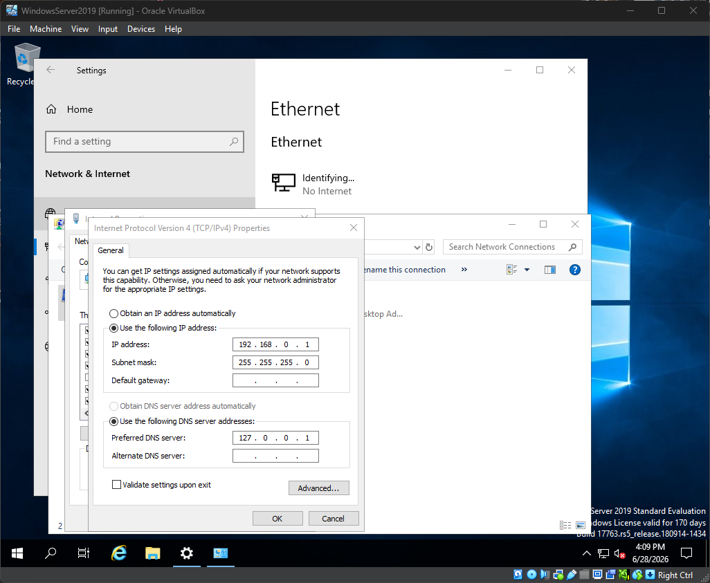
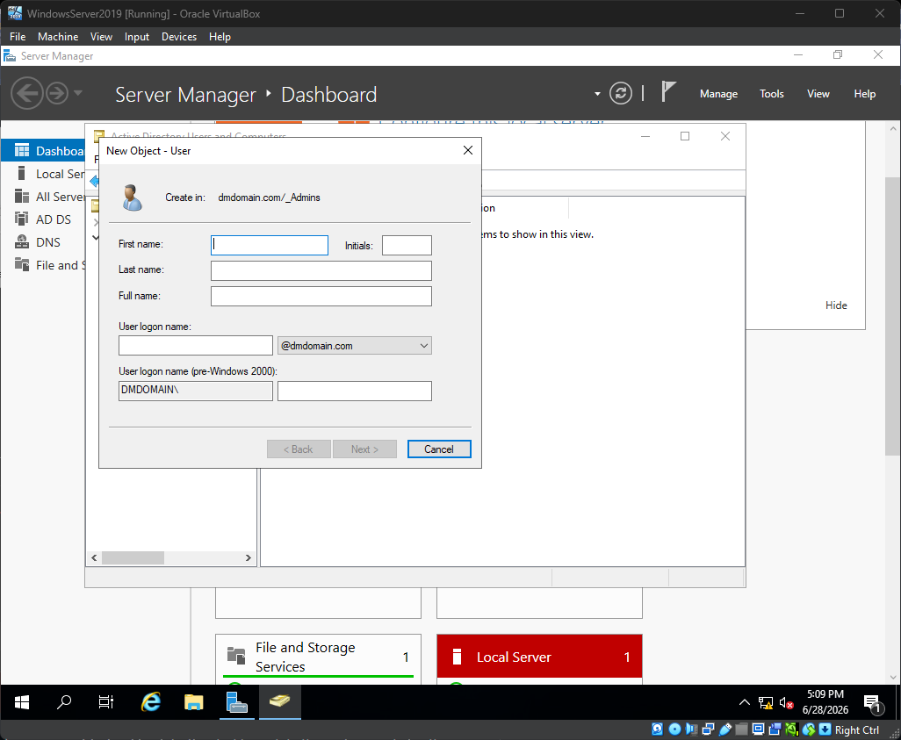

# Active Directory Project

In this project I created an Active Directory Environment that consists of a domain controller on Windows Server 2019. This server has an Active Directory domain simulating a real world corporate environment.  Additionally the server contains DHCP so machines on the private network are automatically assigned IP addresses within the configured scope. Lastly the server contains RRAS routing the systems on the network to the internet.

**Skills demonstrated:** Active Directory Domain Services, DNS, DHCP, NAT/routing (RRAS), Group Policy structure (OUs), and joining a client to a domain built in an isolated virtual lab.

**Network overview:** The domain controller has two network adapters. The *Internet* adapter reaches the outside world, and the *Internal* adapter (192.168.0.1) serves the private lab network. The DC runs DNS, DHCP, and NAT, so client machines get an IP automatically, can find the domain, and can reach the internet all through the one server.

.png)

Tools Used

- VirtualBox
- Windows server 2019
- Windows 10 pro

# Domain Controller Configuration

Configure static IP address for internal NIC on Domain Controller 

- Open the Windows Server Machine
- Navigate to the Network settings: ⊞ Win → Settings → Network and Internet → Ethernet → Change adapter settings
- Rename the networks to Internal and Internet. (You can identify which is which by right clicking and checking the status. The internet adapter will have IPv4 connectivity)
- Right click on the internal adapter → properties → IPv4 and configure it:
    - IP Address: 192.168.0.1
    - Subnet Mask: 255.255.255.0
    - Default Gateway: empty
    - DNS Server: 127.0.0.1

The domain controller needs a static IP because clients on the network locate it using DNS. The DNS server uses the address 127.0.0.1 because the domain controller is its own DNS server.

## **Configure the Active Directory Domain**

Active Directory gives you central control over users computers and policies. This allows you to configure and control the machines on the domain from a central location rather then individually by hand.

Installing Active Directory

1. Go to the server manager application: ⊞ Win → Server Manager
2. Select Add roles and Features
3. Click next until you reach server roles
4. Select Active Directory Domain Services
5. Click next until you reach the end then install

Creating Your Domain

1. After Installation Click the flag in the top right → Promote this server to a domain controller
2. Select Add a new Forest and give the domain a name. I will be using dmdomain.com

1. Click next and create a secure Password for DSRM
2. Uncheck DNS delegation
3. Then select next until you reach the end and install

## Account Creation

Next we will create Users and OUs for users and admins

1. Go to tools → Active Directory Users and computers 

1. Right click on the domain → Organizational unit
2. Name the unit _Employees then click ok
3. Create another Organization unit and call it _Admins

1. Next Right click on the _Admins OU you created → New → User
2. Input user information (Feel free to use whatever credentials you want, in a professional setting for the logon name for admins there is a a_FirstinitialLastname scheme)
3. Click next and create a secure password (Keep record of this)
4. Click next then finish to close the tab
5. Repeat steps 1-3 in the _Employees OU (Note the logon name scheme for normal users is FirstinitialLastname)

We will now give the admin account elevated privileges.

1. Go to the _Admins OU and right click on the user and select properties
2. Select Member of tab → Add
3. Type Domain Admins then check names to verify the permissions are there
4. Click ok apply to confirm the changes and ok again to close the tab
5. To verify the admin account is work logout select other accounts and login with the admin login credentials.

## DHCP

Installing DHCP:

1. Go to the server manager application: ⊞ Win → Server Manager
2. Select Add roles and Features
3. Click next until you reach server roles
4. Select DHCP → Add Features
5. Click next until you reach the end then install and close

1. Select the flag in the top right → Complete DHCP configuration
2. Click next → commit and then close

1. Select tools → DHCP

1. Right click on IPv4 → New Scope → Next

1. Make a name for the scope then click next (Note putting the scope as the name makes it easier to identify)

1. Select the start and end IP for the scope then select next

1. Continue until you reach Router (Default Gateway) Input the IP address of your domain controller (Note: Ensure you select add in order to confirm the address)

1. Continue until then end then select finish then return to the Dashboard.

## RRAS/NAT

1. Go to the server manager application: ⊞ Win → Server Manager
2. Select Add roles and Features
3. Click next until you reach server roles
4. Select Remote Access then Next
5. At Role Services Select Routing → Add Features
6. Continue to the end then install then close

1. Select tools → Routing and Remote Access
2. Right click on your server → Configure and Enable Routing and Remote Access 

1. Select next until you get to configuration and select NAT then click next

1. Select Use this public interface to connect to the internet (Note: You may have to close tabs and return to the dashboard redoing the steps due to a bug.)

1. Continue to the end and click finish.

# Client Windows 10 configuration

We will add a system to the domain. For this project we are using Windows 10 pro.

1. On the windows 10 system go to settings → System → About → Rename this PC (advanced)

1. Select change

1. Change the name of the system from the default
2. Select the Domain option and input your domain name

1. Input the credentials for a user you made in the active directory (Can be admin or regular user)

1. Now after your system restarted go to other user and login using user Account credentials 

# Challenges and notes

- Identifying the adapters: In Windows Server when looking at the 2 network adapters they are both named the same making it difficult to identify. Checking the status for internet connection is the way to differentiate due to only one adapter having the ability to connect to the internet. Renaming the adapters to easily identifiable names will be easier.
- RRAS configuration bug: Enabling Routing and Remote Access sometimes fails partway. When this occurs close the tabs and return to the dashboard then redo the steps to configure NAT.
- Client not connected to the internet. If one of the client machines on your network is unable to connect to the internet it can be for a multitude of reasons.
    - Routing not enabled: This can be determined by going to your client terminal and running the command ipconfig. If there is no Default Gateway then this could be the issue.
        - On your DC go to the DHCP tab → Scope options and verify that Router is connected. If its not right-click on scope options select configure and Select the router. Input your DC IP address select add and apply. Then on your client system run the command ipconfig /renew in order to be given a Default Gateway.
    - Incorrect Interface configuration: Go to Routing and Remote Access → IPv4 → NAT then right-click on each interface and select properties. Ensure the Interface connected to the internet has a public interface with NAT enabled and the private interfaces have a private interface.
